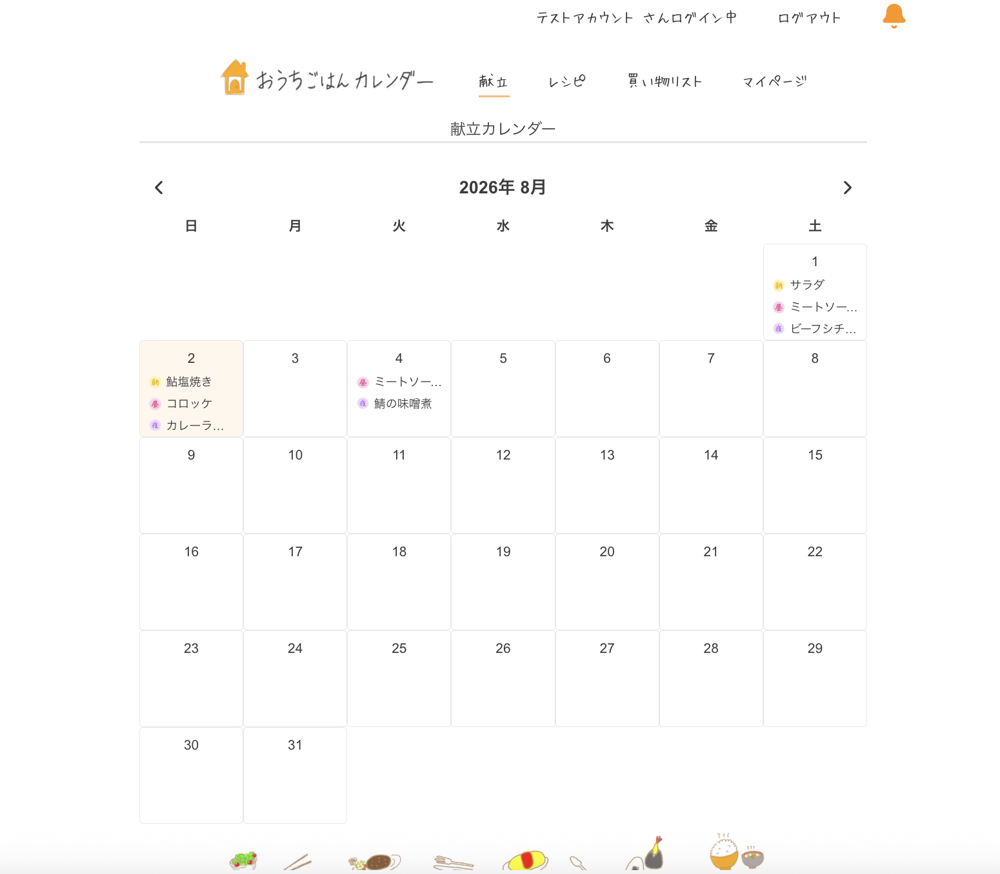
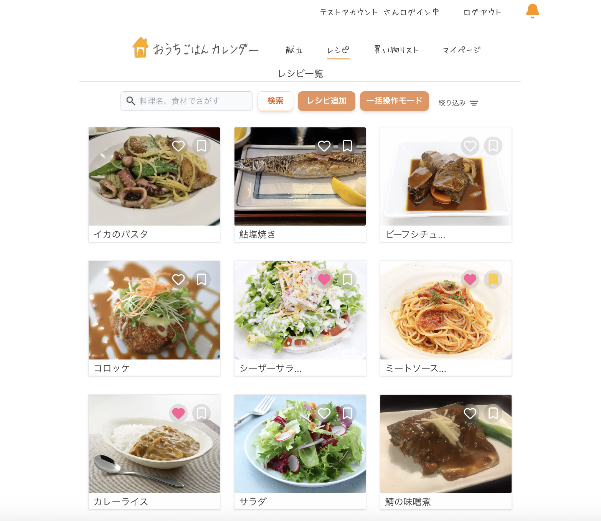
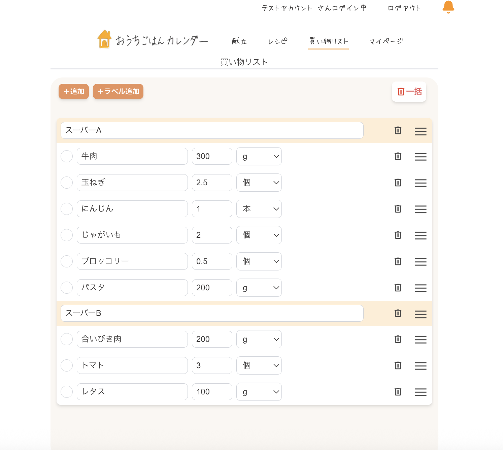
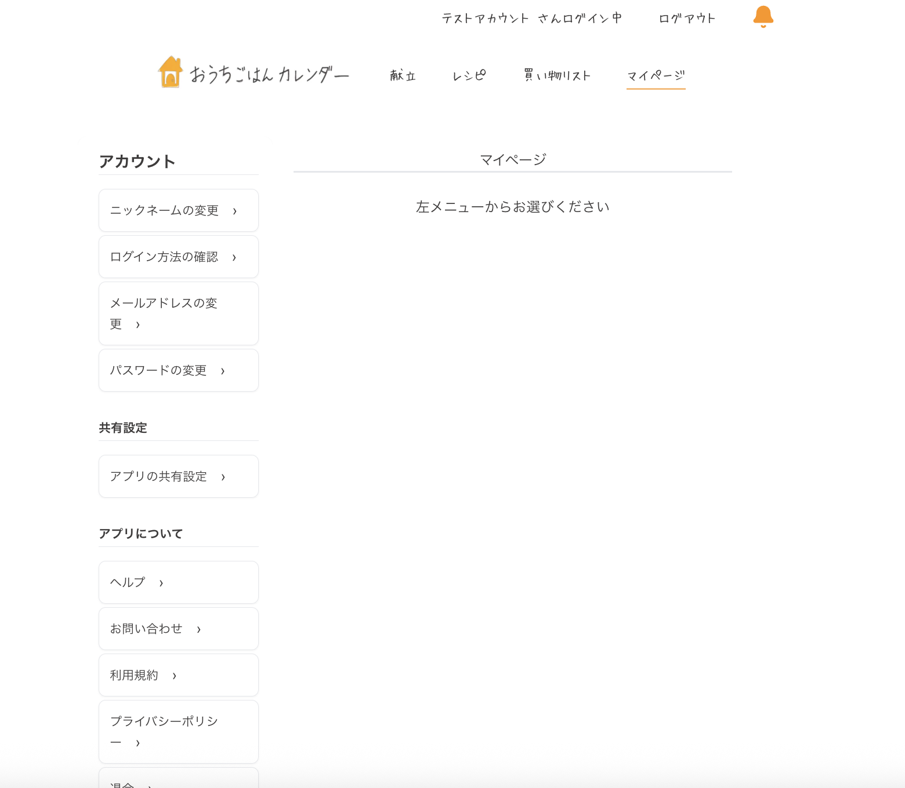

# おうちカレンダー

## 概要

献立・レシピ・買い物リストをまとめて管理し、日々の料理を効率化するためのWebアプリです。

## サービス開発の経緯

普段から料理をする中で、毎週の献立と買い物リストをiPhoneのメモアプリで管理していました。

しかし、献立を考えるたびにレシピを探し直したり、必要な材料を買い物リストへ手作業で書き写したりする必要があり、管理に手間がかかっていました。
そこで、献立・レシピ・買い物リストをひとつのアプリでまとめて管理できれば、毎日の食事準備をより効率化できると考え、「おうちカレンダー」を開発しました。

## URL

https://home-calender-rjlg.vercel.app/

## テストアカウント

- メール：hometest01@svk.jp
- パスワード：TestHome001

## 使用技術

- Next.js
- React
- TypeScript
- Prisma
- Supabase
- Tailwind CSS
- SWR

## 主な機能

<table>
  <tr>
    <th width="50%">献立カレンダー</th>
    <th width="50%">レシピ一覧</th>
  </tr>
  <tr>
    <td align="center">
      
    </td>
    <td align="center">
      
    </td>
  </tr>
  <tr>
    <td>
      朝・昼・夜の献立をカレンダー形式で管理できる画面です。
      登録済みのレシピから献立を選択でき、日ごとの食事予定を分かりやすく確認できます。
    </td>
    <td>
      登録したレシピを一覧で確認できる画面です。
      キーワードやカテゴリによる検索のほか、お気に入りや調理済みの状態でレシピを管理できます。
    </td>
  </tr>
  <tr>
    <th width="50%">買い物リスト</th>
    <th width="50%">マイページ</th>
  </tr>
  <tr>
    <td align="center">
      
    </td>
    <td align="center">
      
    </td>
  </tr>
  <tr>
    <td>
      献立に登録したレシピの材料から、買い物リストを作成できる画面です。
      同じ食材はまとめて表示され、購入済みのチェックやドラッグ操作による並び替えにも対応しています。
    </td>
    <td>
      ニックネームやメールアドレス、パスワードなどのアカウント情報を管理できる画面です。
      家族との共有設定や利用方法の確認、退会手続きも行えます。
    </td>
  </tr>
</table>

## 工夫した点

- Googleログイン・メール認証
- DnDによる並び替え
